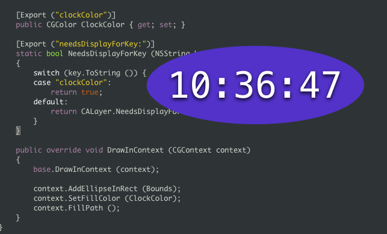

# AnimatedClock

Shows the use of custom property animations for `CALayers` in the `CoreAnimation` Layers API.  
This is based on the GlossyClock sample.

## Author

Ported to Xamarin.Mac by Rolf Bjarne Kvinge.
