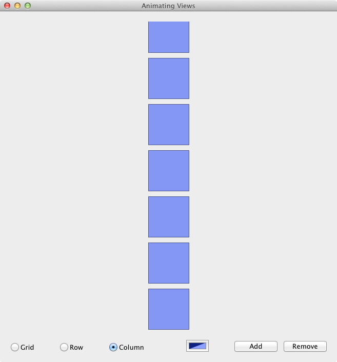

# AnimatingViews

The Animating View sample shows how to use `CoreAnimation` to animate views. The code that does the animation lives in the `AnimatingViewsWindowController.cs` file and shows how to animate either using the simple API (just assigning a value to the Frame property) or manually controlling the animation's properties.

## Prerequisites

* Mac computer with the latest version of macOS.
* [Visual Studio for Mac](https://visualstudio.microsoft.com/vs/mac/).
* Latest version of [Xcode](https://developer.apple.com/xcode/) from Apple.

## Running the sample

1. Open the solution file (**.sln**) in Visual Studio for Mac.
1. Use the **Run** button or menu to start the app.
