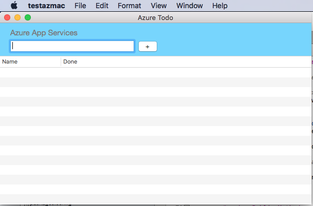

# AzureToDoMac

This sample covers using Azure Cloud Data in a Xamarin.Mac application by creating a simple ToDo list application.

## UPDATE: the most recent (Nov-16) version of the [Azure Mobile Client NuGet](https://www.nuget.org/packages/Microsoft.Azure.Mobile.Client/) doesn't explicitly support the Xamarin.Mac platform, so the NET45 assemblies have been referenced directly in this sample.

**NOTE:** You'll need to edit the `Constants` class and provide your Azure Developer Credentials by setting the `ApplicationURL` values _before_ this sample can be successfully run.

## The table configured in Azure should also have the same columns as the `TodoItem` class: `id`, `text`, `notes`, `complete`.

