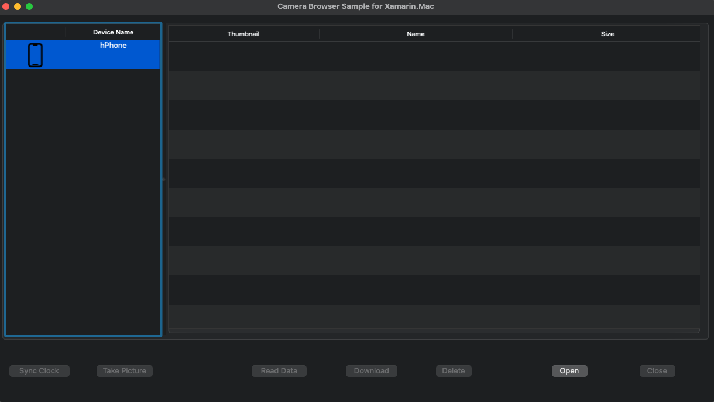

# CameraBrowser

This sample demonstrates how to read, download, and delete media files from a device using the `ImageCaptureCore` framework. Based on the [Camera Browser Sample](https://developer.apple.com/library/archive/samplecode/CameraBrowser/Introduction/Intro.html#//apple_ref/doc/uid/DTS40007761-Intro-DontLinkElementID_2).

## Prerequisites
* Mac computer with the latest version of macOS.
* [Visual Studio for Mac](https://visualstudio.microsoft.com/vs/mac/).
* Latest version of [Xcode](https://developer.apple.com/xcode/) from Apple.

## Running the sample
1. Open the solution file (**.sln**) in Visual Studio for Mac.
1. Use the **Run** button or menu to start the app.
