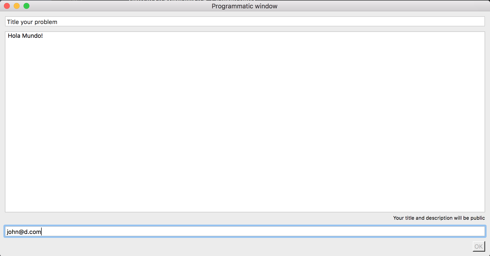

# Constraints

This sample shows how to use UI constraints in Xamarin.Mac apps.

## Build Requirements

OS X 10.12, Xcode 8.0 or later

## Runtime

OS X 10.12

## Prerequisites

* Mac computer with the latest version of macOS.
* [Visual Studio for Mac](https://visualstudio.microsoft.com/vs/mac/).
* Latest version of [Xcode](https://developer.apple.com/xcode/) from Apple.

## Running the sample

1. Open the solution file (**.sln**) in Visual Studio for Mac.
1. Use the **Run** button or menu to start the app.
