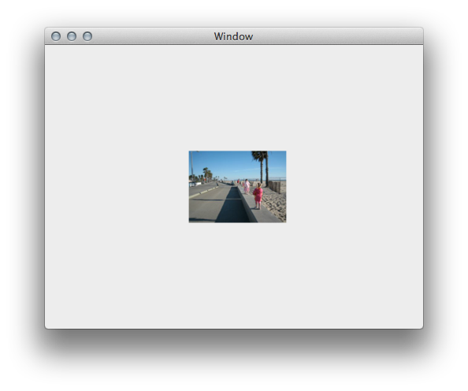

# CoreAnimationBook

The samples in this directory are ports from the book "Pragmatic's Core Animation for Mac OS X" and show how to use CoreAnimation with Xamarin.Mac.

## Prerequisites

* Mac computer with the latest version of macOS.
* [Visual Studio for Mac](https://visualstudio.microsoft.com/vs/mac/).
* Latest version of [Xcode](https://developer.apple.com/xcode/) from Apple.

## Running the sample

1. Open the solution file (**.sln**) in Visual Studio for Mac.
1. Use the **Run** button or menu to start the app.
