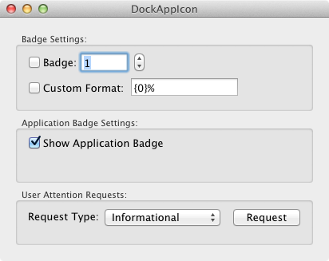

# DockAppIcon

Shows the use of the `NSDockTile`.

* Adding a badge to the icon in the Dock provides a setting to add a custom format.
* Manipulating the Application Badge.
* Getting the users attention: Informational and Critical.

## Instructions

To see the request for attention:
* Use the Request Button.
* Move away from this application by activating another application within 3 seconds.
* The requests only work if the requesting application is not the active application.

## Author

Ported to Xamarin.Mac by Kenneth J. Pouncey.