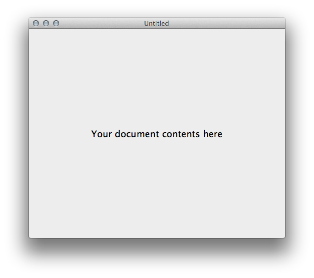

# DocumentSample

Shows how to create a Document-based application.

Document-based applications are supported by the `NSDocument` family of classes and take a lot of the repetitive work of creating a multi-document application out of the user hands.

They take care of loading, saving, creating new instances and closing of windows for you.

In addition to this sample, there is a template in Xamarin Studio that will create the basics for you.

## Prerequisites

* Mac computer with the latest version of macOS.
* [Visual Studio for Mac](https://visualstudio.microsoft.com/vs/mac/).
* Latest version of [Xcode](https://developer.apple.com/xcode/) from Apple.

## Running the sample

1. Open the solution file (**.sln**) in Visual Studio for Mac.
1. Use the **Run** button or menu to start the app.
