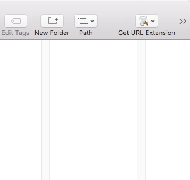

# ExtensionSamples

This sample demonstrates how to use app extensions in Xamarin.Mac. To register an extension on your machine you'll need run the host application, **ExtensionSamples** one time and then enable each plugin from the **System Preference** Extension panel. 

Open "Console" application to view the system log to view NSLog / Errors / Crashes of extension. Cleaning this project will unregister this plugin from the system.

Sample extensions:
* Share extension
* Finder extension
* Today extension

## Build Requirements
OS X 10.11, Xcode 7.0 or later

## Runtime
OS X 10.11

## Copyright

Xamarin samples released under the MIT license

## Author

Chris Hamons
