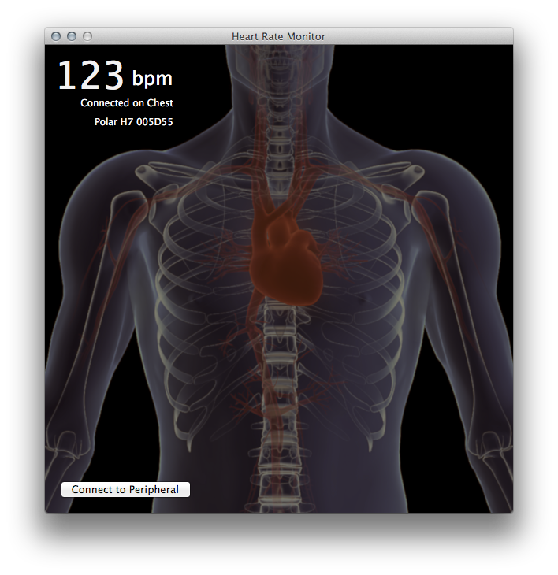
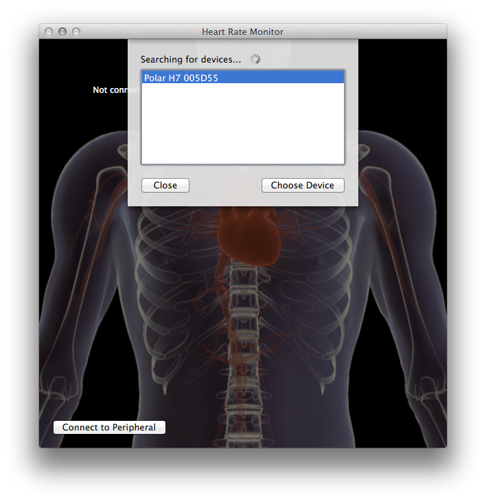

# MonoMac.CoreBluetooth

The Core Bluetooth framework provides the classes needed for your iOS
and Mac apps to communicate with devices that are equipped with
Bluetooth low energy wireless technology, such as heart rate monitors,
cycling cadence sensors, and temperature monitors.

This sample demonstrates discovering, connecting to, and retrieving
heart rate data from Bluetooth LE heart rate monitors.

It shows the location of the monitor (chest, wrist, foot, etc.), the
current heart rate in beats per minute, and animates a heart beating
at the same speed reported by the connected device.

