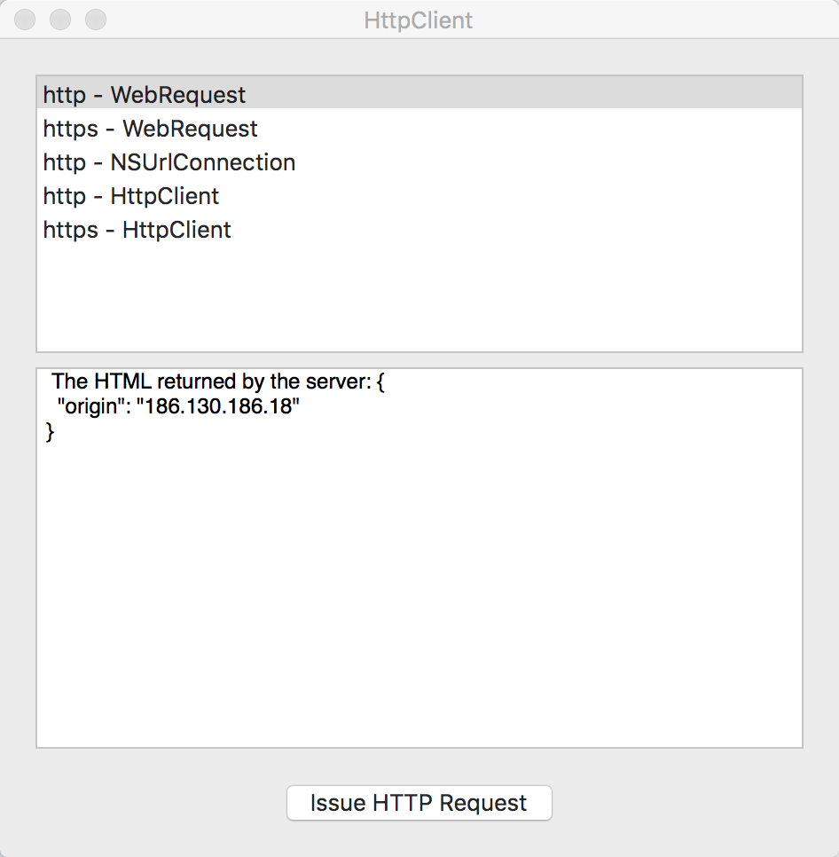

# HttpClient

This sample shows how to issue http/https web requests using .NET and Objective-C API.
Main actions takes place in NetworkHandlers.cs file. There you will find Cocoa and DotNet classes.
DotNet class uses standard WebRequest to create web-requests. On the other hand Cocoa utilizes NSUrlRequest native class.

## Build Requirements

OS X 10.10, Xcode 6.0 or later

## Runtime
OS X 10.10

## References
Checkout how to issue http/https web requests in Xamarin.iOS [here](https://github.com/xamarin/monotouch-samples/tree/master/HttpClient)

## Author 
Chris Hamons
