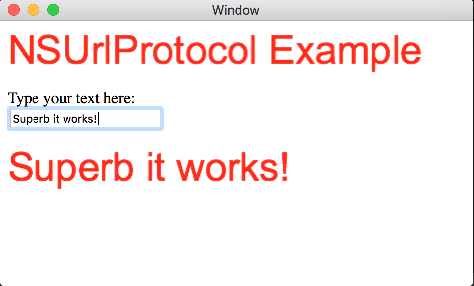

# ImageProtocol in Xamarin.Mac

This sample illustrates how to register a custom NSUrlProtocol in Xamarin.Mac.

## Build Requirements

OS X 10.11, Xcode 8.0 or later

## Runtime

OS X 10.11

## License
