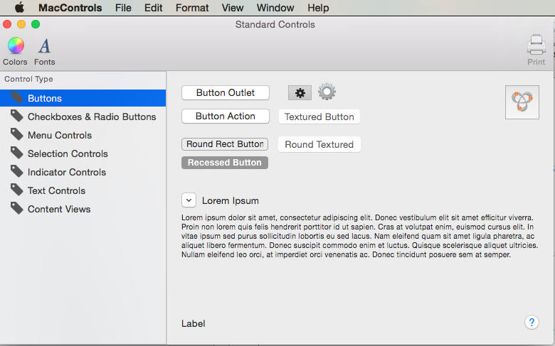

# MacControls

Source code for the [Standard Controls]https://docs.microsoft.com/xamarin/mac/user-interface/standard-controls) documentation on [Xamarin Developer Center](http://docs.microsoft.com/xamarin)

When working with C# and .NET in a Xamarin.Mac application, you have access to the same Standard AppKit Controls that a developer working in in *Objective-C* and *Xcode* does.

AppKit Controls are the UI Elements that are used to create the User Interface of your Xamarin.Mac application. They consist of elements such as Buttons, Labels, Text Fields, Check Boxes and Segmented Controls and cause instant actions or visible results when a user manipulates them.

This sample application covers working with the standard AppKit controls such as Buttons, Labels, Text Fields, Check Boxes and Segmented Controls in a Xamarin.Mac application.

## Prerequisites

* Mac computer with the latest version of macOS.
* [Visual Studio for Mac](https://visualstudio.microsoft.com/vs/mac/).
* Latest version of [Xcode](https://developer.apple.com/xcode/) from Apple.

## Running the sample

1. Open the solution file (**.sln**) in Visual Studio for Mac.
1. Use the **Run** button or menu to start the app.
