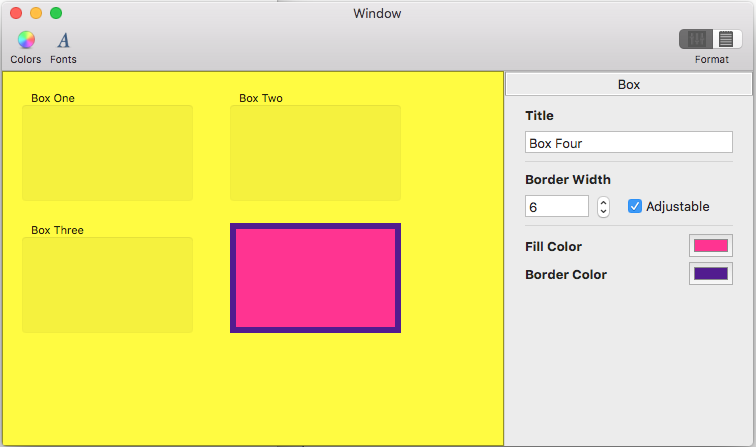

# MacInspector

Most modern OS X applications present auxiliary controls and options that affect the active document or selection as **Inspectors** that are part of the Main Window (like Apple's Pages or Numbers apps), instead of using [Panel Windows](https://docs.microsoft.com/xamarin/mac/user-interface/window#Panels).

While **Panel Windows** have been deprecated in Storyboards, Apple does not provide a specific User Interface Widget to build **Inspectors**. Instead the developer must use `NSSplitViewControllers` and standard UI Widgets (such as Checkboxes and Text Fields) to create the [Inspector Interface](https://docs.microsoft.com/xamarin/mac/user-interface/window#Inspectors).

This app shows an example of creating two different types of Inspector Panels and running those panels with a Split View. It also uses a [Segment Control](https://docs.microsoft.com/xamarin/mac/user-interface/standard-controls#Working_with_Selection_Controls) in the [Toolbar](https://docs.microsoft.com/xamarin/mac/user-interface/toolbar) to control the **Inspector** similar to Apple's Pages word processing app.

The code has been fully commented and, where available, links have be provided from key technologies or methods to relevant information in the [Xamarin.Mac Guides Documentation](https://developer.xamarin.com/guides/#mac).

A [Read Me](https://github.com/xamarin/mac-samples/tree/master/MacInspector/Documentation) document has been provided with a brief description of how the app was designed and works along with complete **API Documentation** (available in `Documentation/html/index.html` when downloaded) for the app.

## Prerequisites

- Mac computer with the latest version of macOS.
- [Visual Studio for Mac](https://visualstudio.microsoft.com/vs/mac/).
- Latest version of [Xcode](https://developer.apple.com/xcode/) from Apple.

## Running the sample

1. Open the solution file (**.sln**) in Visual Studio for Mac.
1. Use the **Run** button or menu to start the app.
