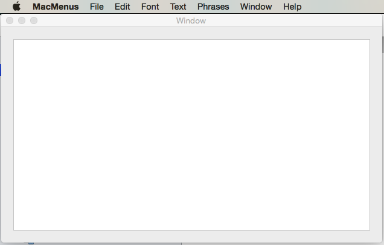

# MacMenus

Source code for the [Menus](https://docs.microsoft.com/en-us/xamarin/mac/user-interface/menu) doc in the [Xamarin Documentation](http://docs.microsoft.com/xamarin)

This project covers working with Menus in a Xamarin.Mac application and includes examples of every time of menu that can be used in macOS.

## Prerequisites

- Mac computer with the latest version of macOS.
- [Visual Studio for Mac](https://visualstudio.microsoft.com/vs/mac/).
- Latest version of [Xcode](https://developer.apple.com/xcode/) from Apple.

## Running the sample

1. Open the solution file (**.sln**) in Visual Studio for Mac.
1. Use the **Run** button or menu to start the app.
