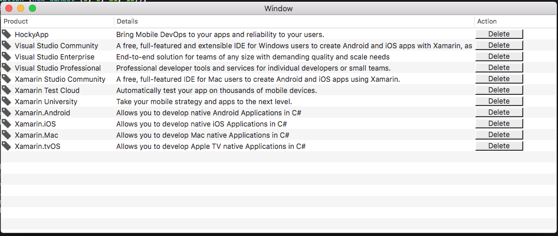

# MacTables

Source code for the [Table Views](https://docs.microsoft.com/en-us/xamarin/mac/user-interface/table-view) documentation on [Xamarin Developer Center](http://docs.microsoft.com/xamarin)

This sample covers working with Table Views in a Xamarin.Mac application. It covers creating and maintaining Table Views in Xcode and Interface builder, how to expose the Table View Items to code using Outlets and Actions, populating Table Views and finally responding to Table View Items in C# code.

## Prerequisites

- Mac computer with the latest version of macOS.
- [Visual Studio for Mac](https://visualstudio.microsoft.com/vs/mac/).
- Latest version of [Xcode](https://developer.apple.com/xcode/) from Apple.

## Running the sample

1. Open the solution file (**.sln**) in Visual Studio for Mac.
1. Use the **Run** button or menu to start the app.
