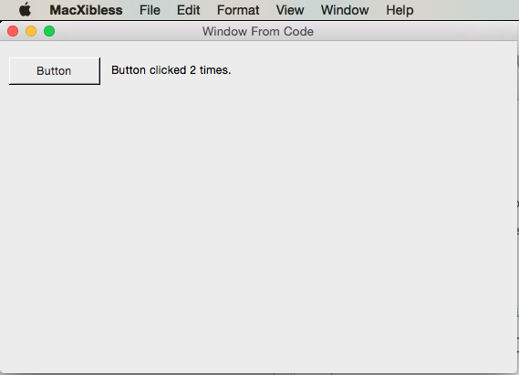

# MacXibless

Source code for the [.XIBless User Interface Design](https://docs.microsoft.com/xamarin/mac/app-fundamentals/xibless-ui) documentation on [Xamarin Developer Center](http://docs.microsoft.com/xamarin).

This project covers creating a Xamarin.Mac Application's User Interface directly from C# code without using Xcode's Interface Builder or `.xib` files.

## Prerequisites

* Mac computer with the latest version of macOS.
* [Visual Studio for Mac](https://visualstudio.microsoft.com/vs/mac/).
* Latest version of [Xcode](https://developer.apple.com/xcode/) from Apple.

## Running the sample

1. Open the solution file (**.sln**) in Visual Studio for Mac.
1. Use the **Run** button or menu to start the app.
