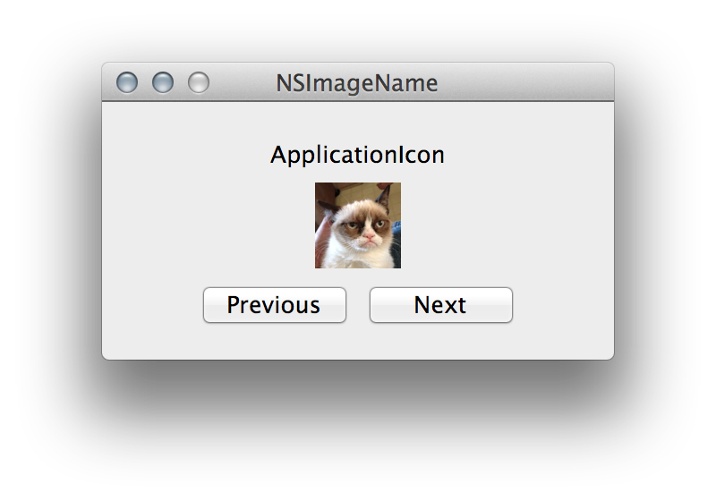

NSImageName Sample
==================

A simple sample application demoing the `NSImageName` enum for `NSImage.ImageNamed`.
The sample cycles through all possible values and displays the corresponding image.

