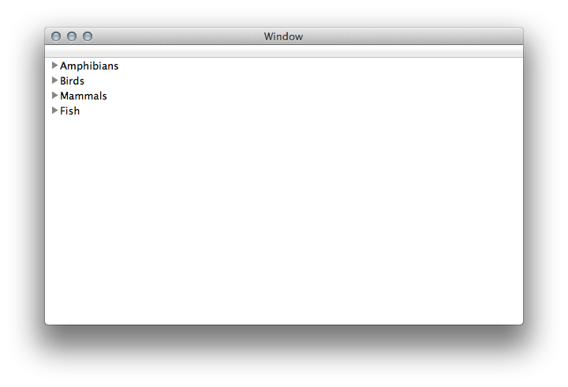

# OutlineView

Illustrates how to populate a simple `OutlineView` using an `NSViewOutlineDataSource` that in 
turn, uses an object tree of animal classes.

## Author

Ported to Xamarin.Mac by Bryan Costanich.