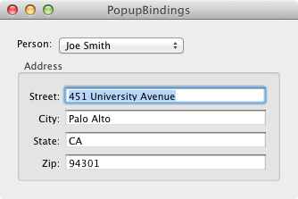

# PopupBindings

"PopupBindings" is a Xamarin.Mac sample application that demonstrates how to use the bindings to manage the contents and selection of the `NSPopupButton` class. It uses the `NSArrayController` class to hold the data and track the selection.

This is done using the following `NSPopupButton` bindings:

The content binding describes the collection of objects. The collection is the objects in the array controller.

	Bind to: PopupList
	Controller Key: arrangedObjects
	Model Key Path: (leave blank)

The contentValues binding describes what will be displayed in the pop-up menu. In this example it will be "name" portion of the `Person` object. Use the following choices for the contentValues binding:

	Bind to: PopupList
	Controller Key: arrangedObjects
	Model Key Path: name

The selectedIndex binding describes the indexed selection the user chose from the menu. Use the following choices for the selectedIndex binding:

	Bind to: PopupList
	Controller Key: selectionIndex
	Model Key Path: (leave blank)

All four Form Cells describing the person's address is bound to the array controller's selection using a specific `NSDictionary` key. So for the "street" Form Cell (Street), its value binding should look like:

	Bind to: PopupList
	Controller Key: selection
	Model Key Path: addressStreet

## Copyright

Xamarin port changes are released under the MIT license

## Author 

Ported to Xamarin.Mac by Kenneth J. Pouncey.
