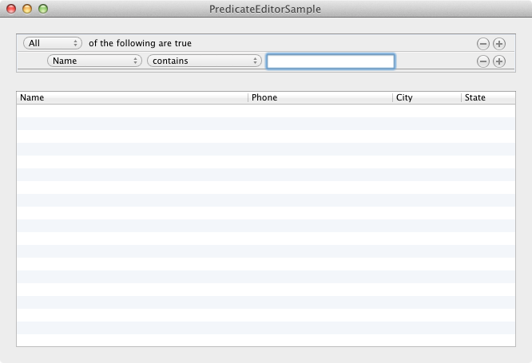

# PredicateEditorSample

"PredicateEditorSample" is a Xamarin.Mac sample application that shows how to use the `NSPredicateEditor`.

The `NSPredicateEditor` class is a subclass of `NSRuleEditor` that is specialized for editing `NSPredicate` objects. This sample is intended to show how to use the many different features and aspects of this control and leverages Spotlight to search your Address Book.

It shows how to:

* Manage this control inside your window along with an `NSTableView`.
* Build Spotlight friendly queries based on `NSPredicate` and `NSCompountPredicate`.
* Build search results based on `NSMetadataQuery` object.

## Instructions

Simply build and run the sample using MonoDevelop with the Xamarin.Mac plugin. Enter query information pertaining to your Address Book. The application will display matches in its table view.

AddressBook searches are achieved by specifically requesting the "kind" of data to search via the `kMDItemContentType` key constant. This is the metadata attribute key that tells Spotlight to search for
address book data only. Together along with the other predicates from the `NSPredicateEditor` class we form a "compound predicate" and start the query. The code snippet below found in this sample shows how this is done:

	// always search for items in the Address Book
	NSPredicate addrBookPredicate = NSPredicate.FromFormat("(kMDItemContentType == 'com.apple.addressbook.person')",new NSObject[0]);
	predicate = NSCompoundPredicate.CreateAndPredicate(new NSPredicate[2] {addrBookPredicate, predicate});
	
	// set the query predicate....
	query.Predicate = predicate;
	
	// and send it off for processing...
	query.StartQuery();

## Copyright

Xamarin port changes are released under the MIT license

## Author

Ported to Xamarin.Mac by Kenneth J. Pouncey.
