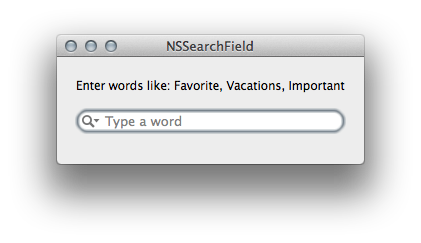

# SearchField

SearchField is a Xamarin.Mac sample application that shows how to use a special text control called `NSSearchField`.  
This is the control that is used in the popular Apple applications like Safari, iTunes, Mail, etc.

## Summary

An `NSSearchField` object implements a text field control that is optimized for performing text-based searches. 
The control provides a customized text field for entering search data, a search button, a cancel button, 
and a pop-up icon menu for listing recent search strings and custom search categories.

When the user types and then pauses, the `NSSearchField` cell’s action message is sent to its target. 
You can then query the cell’s string value for the current text and search a list of keywords to match, 
then providing these words to the control's drop down menu.  

This sample shows you how to override the text-based searching by providing your own list of keywords.

With regards to the popup icon to show the recents menu listing recent search strings, this sample shows how to further customize this menu by building the menu completely from scratch. You can do this using InterfaceBuilder, but the code gives you a better illustration.

## Keyword Searching

Basically we want to override the `NSSearchField` type completion feature by providing our own list of keywords to match.  
Therefore its up to us to call the `NSTextView Complete()` method at the right time.

Each time a character is typed, a lookup occurs every time the Changed delegate is called. If you don't want the drop down list to show on each character typed, then you need to call `Complete()` less frequently. Each lookup forces the drop down list to update itself causing the menu to disappear and reappear again with the new matches. So calling `Complete()` from within the Changed delegate can flood the run loop by repeatedly generating "Changed" calls.  
So we need to be a little smarter not to post Complete() when it's not necessary.

## Enhancements

Hence, by implementing the `GetCompletions` delegate you now have complete control on the contents on which text-based searching is based.

## Copyright

Xamarin port changes are released under the MIT license

## Author 

Ported to Xamarin.Mac by Kenneth J. Pouncey.
