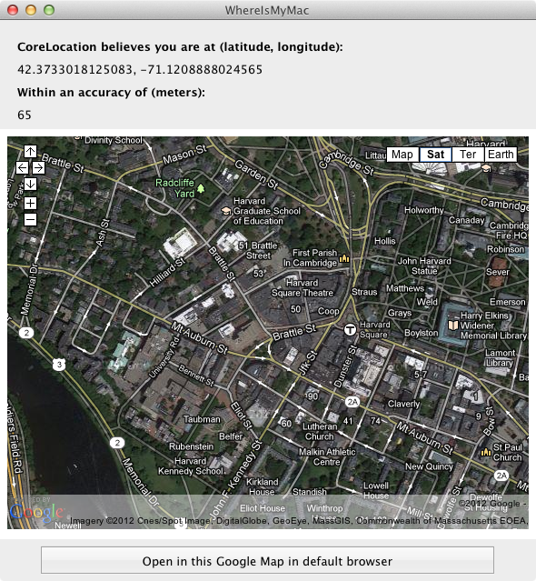

# WhereIsMyMac

Shows the use of the CoreLocation API.

For a full description of the program and the original article point your browser here:
[WhereIsMyMac]

## Author 

Ported to Xamarin.Mac by Kenneth J. Pouncey.

[WhereIsMyMac]:http://cocoawithlove.com/2009/09/whereismymac-snow-leopard-corelocation.html