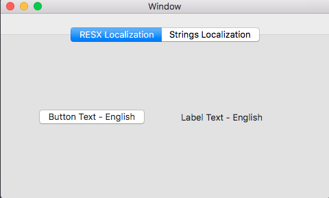
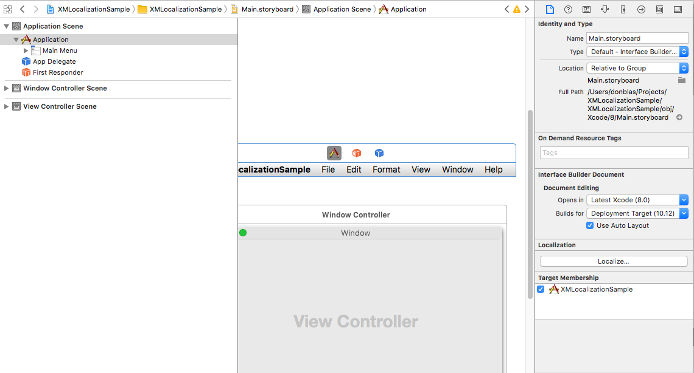
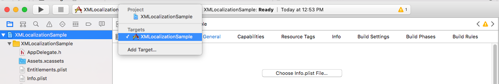

# XMLocalizationSample

This sample shows two methods for localization your Xamarin.Mac application:

- .resx files
- Storyboard string files.

Due to bug https://bugzilla.xamarin.com/show_bug.cgi?id=45696, where resx file localization is not being handled 
correctly during builds, custom MSBuild has been added to make things work. See CustomBuildActions.targets for details.

To add storyboard localization in Xcode:

- Open Main.storyboard in Xcode, select it in the Xcode project tree, then click "Localize" in the first tab of the right inspector.

    

- Then select the root project in the project tree, change the upper dropdown to point to the project.

    

- Then enable Base localization.

    

- Then add the specific languages in question.

    

- Close Xcode and delete Main.storyboard from your project, as it now is copied into specific Resources/ folder.

## Build Requirements

OS X 10.11, Xcode 8.0 or later

## Runtime

OS X 10.11

## License

Released under the MIT license
