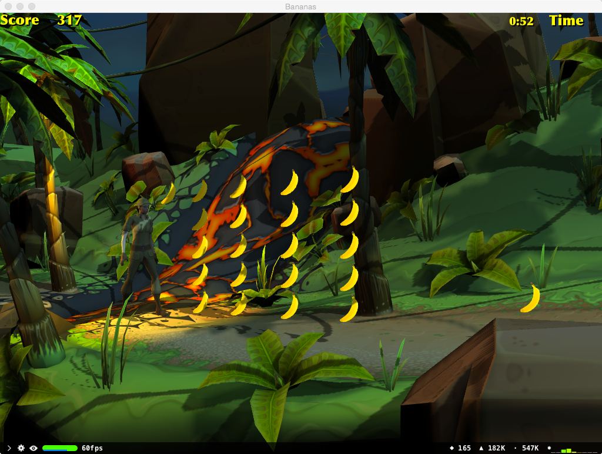

# Bananas

This sample shows how to build a basic game using Scene Kit, demonstrating physics, rendering techniques, lighting, actions and animation.

## Build Requirements

OS X 10.10, Xcode 6.0 or later

## Runtime

OS X 10.10

## License

Xamarin port changes are released under the MIT license
