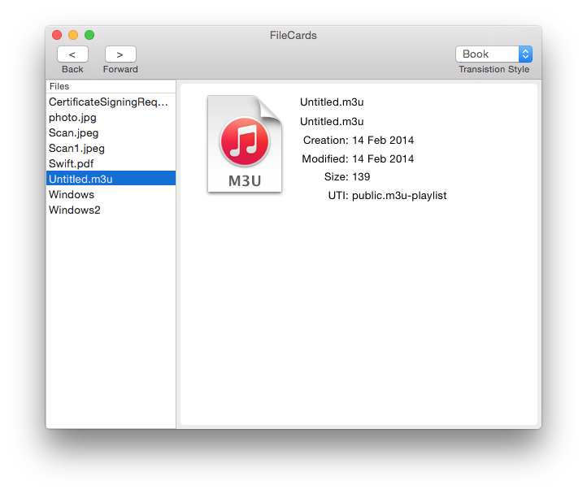

# FileCards

Demonstrates the use of `NSPageController`.
App are displayed for the contents of the user's `Documents` folder.
You can swipe, click the arrow buttons or click on the entry in the table to switch between cards.

`AppDelegate`:  
Implements the NSPageControllerDelegate methods.
There are few interesting advanced techniques shown in this file:
- How to programmatically change the `PageController.SelectedIndex`.
- The use of more than 1 identifier so that we can have 2 card styles.

`FileObject`:  
Simple wrapper around NSUrl to make binding to file properties in IB easier.

`CardBackgroundView`:  
Draws the rounded edge background of the file cards.

## Build Requirements

Xcode 6.0, OS X 10.10

## Runtime Requirements

OS X 10.8 or later

## License

Xamarin port changes are released under the MIT license
