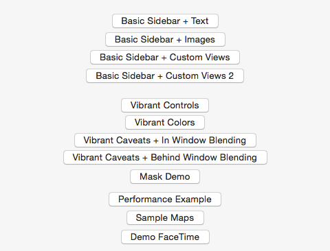

# Blurs, translucency and vibrancy on macOS

This sample shows how to use various options of NSVisualEffectView to do blurs, translucency, and vibrancy on macOS. It demonstrates in window blending, behind window blending, creating masks, using state, and custom vibrant controls.

## License

Xamarin port changes are released under the MIT license
